

    <h1 align="center">Python在线实验平台</h1>

	
    
    
    

## 一、简单讲讲

PyOnline是一款基于SSMP和Vue开发的Python在线实验平台，系统主要提供Python代码在线编译运行、实验评分、实验数据记录、实验结果下载、公告发布、班级管理、实验编辑等功能。系统为前后端分离架构，前端基于CodeMirror和Vue开发，使用Element UI辅助设计；后端基于SpringBoot框架，使用MybatisPlus完成持久层设计，调用Python3编译器实现核心功能；项目已写好Dockerfile，可随时部署上线。

## 二、功能介绍

系统中有三种角色：老师、学生、管理员，前两种角色可以自行注册；

### 1. 作为教师，你可以：

- 创建班级，添加，编辑班级简介，**分享班级邀请码**让学生加入；
- 发布、编辑、删除实验，**按章节管理、调整实验目录结构**；
- **查询并下载学生实验结果及代码**，查看实验得分；
- 发布、编辑、删除**班级内通知**；
- 修改个人信息；

### 2. 作为学生，你可以：

- 通过**邀请码加入班级**，查看班级信息；
- 使用**在线编译平台**完成老师发布的实验内容，**在线运行Python程序**并携带参数，查看运行结果，**下载代码**；
- **查询实验记录**并下载实验代码和结果；
- 查询班级内部通知；
- 修改个人信息；

### 3. 作为管理员，你可以：

- 查询系统中所有用户数据；
- 添加账户，修改密码，查询、**导出用户数据**；

## 三、运行展示

### 1.学生端

- 用户登录

- 班级页面

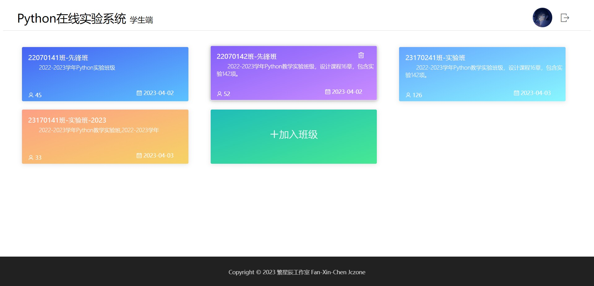

- 班级内实验列表（可收缩）

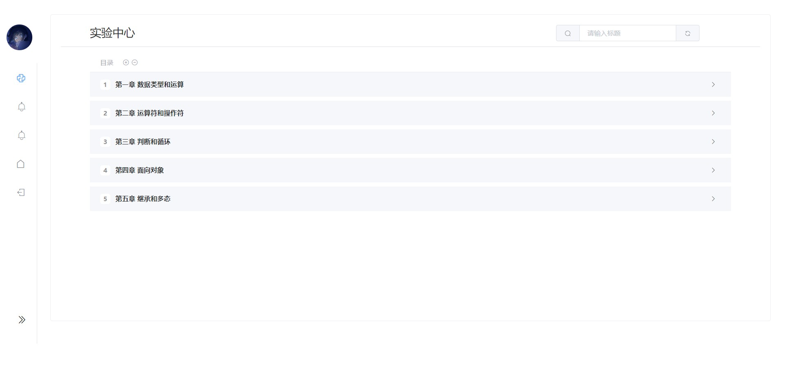

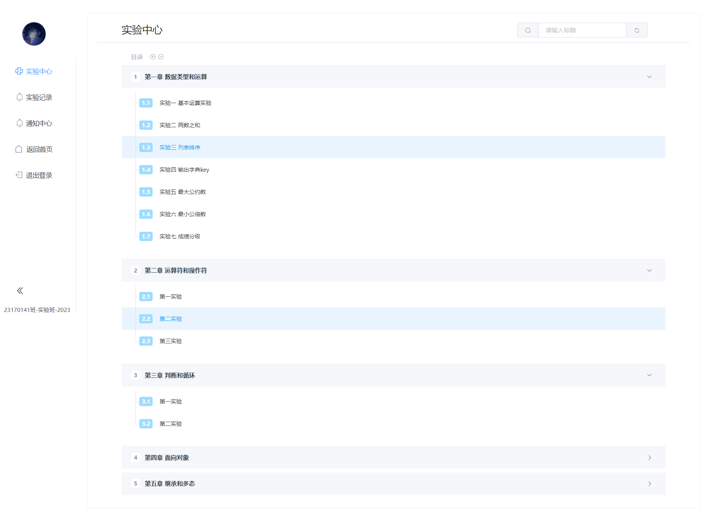

- 在线实验环境（可切换主题）

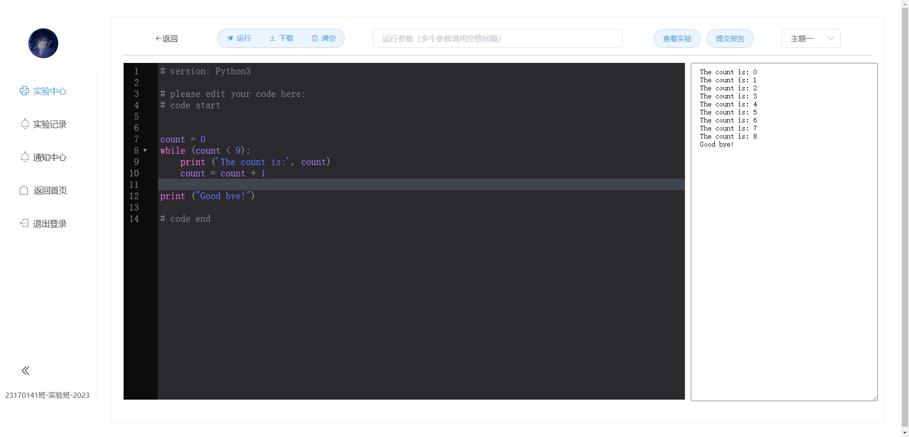

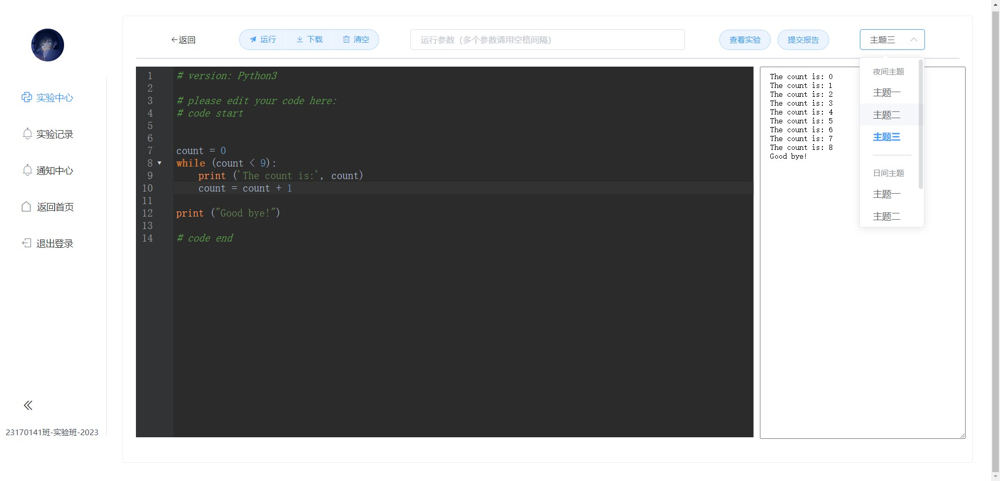

- 查看实验内容

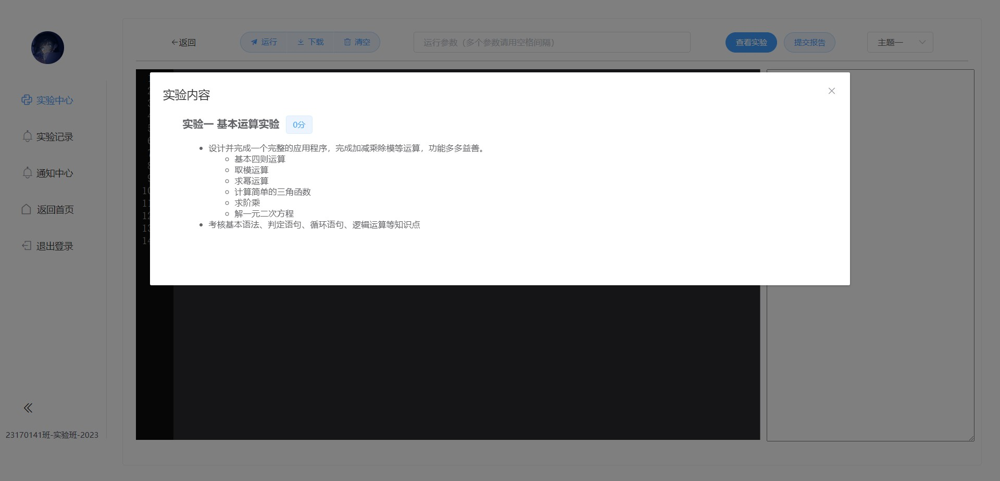

- 实验记录

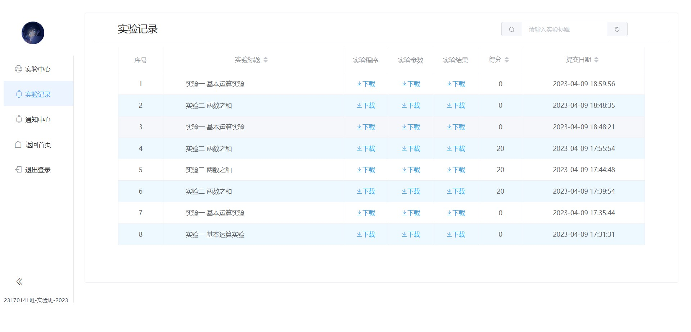

- 查看班级通知

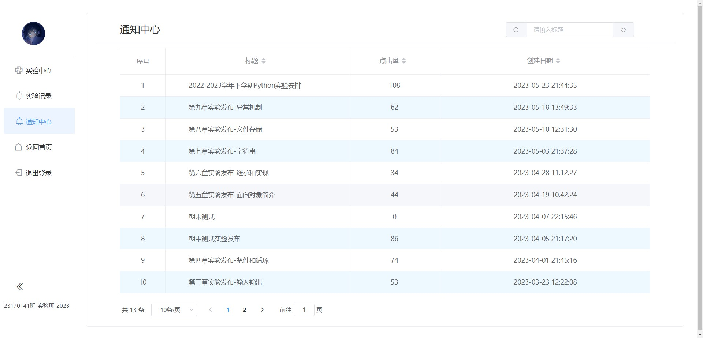

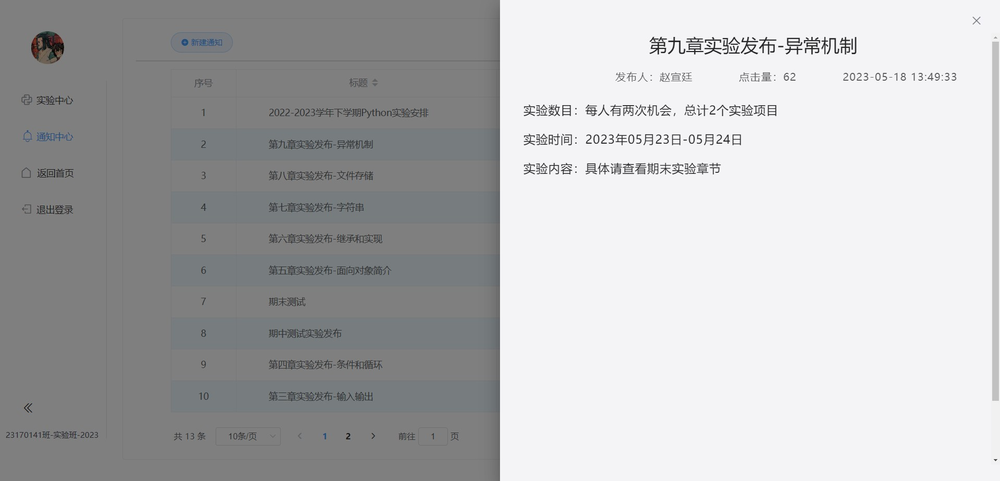

### 2. 教师端

- 班级管理页面

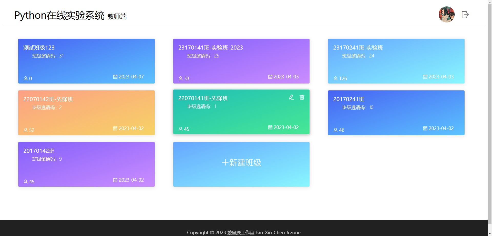

- 查询学生实验记录

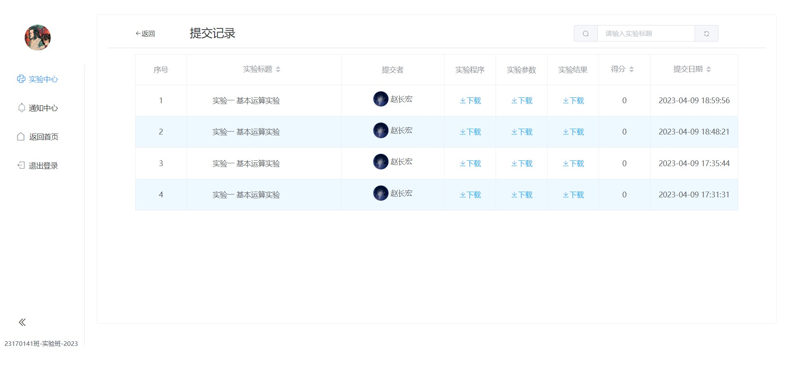

- 实验编辑和发布

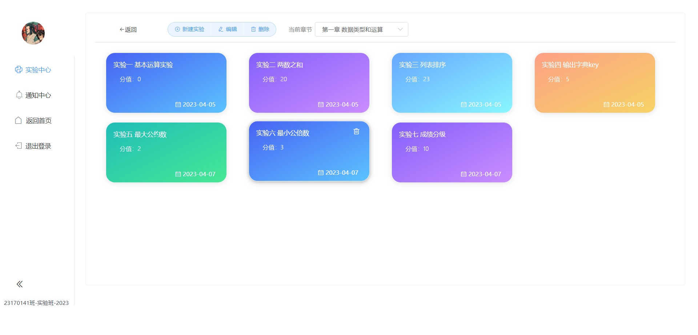

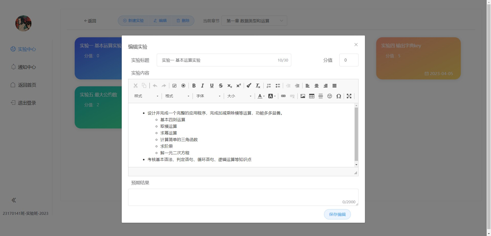

- 通知编辑和发布

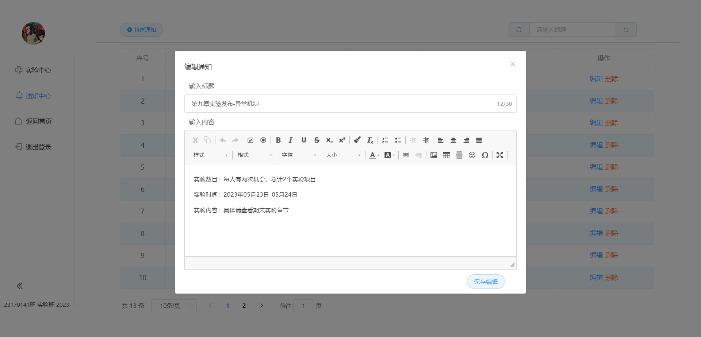

### 3. 管理员

- 用户管理和数据导出

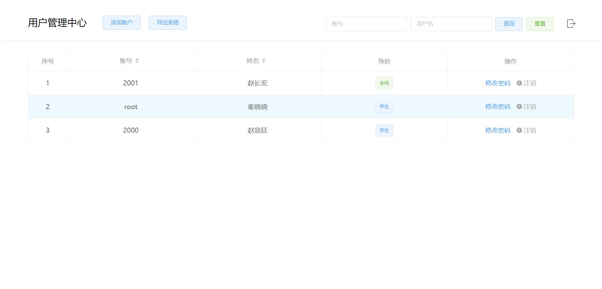

## 四、如何运行项目

  项目前后端分离，建议用IDEA运行后端，WebStorm运行前端，开发环境需安装Node.js和MySQL，数据库用Navicat操作。

### 1. 后端项目（py_online)

下载后用idea打开项目，初次加载idea会自动下载依赖，最好先配置镜像源或科学上网，这个过程可能需要1h左右。此时可以在MySQL中创建一个名为py_online的数据库，运行后端文件夹中的py_online.sql文件，即可完成数据库初始化。项目加载完成后，在application.yml中修改项目路径为你当前的项目路径，配置好数据库连接，即可运行后端了。

### 2. 前端项目（py_online_front)

下载后用WebStorm打开项目文件夹，命令`npm install`手动安装node_modules，出现爆红和冲突请后缀`--force`。模块导入完成后，需要配置运行栏，选择npm运行，命令为run，Scripts为serve。

前端项目没有做比例适配，建议浏览器使用125%缩放。

## 五、更新日志

- 20230716-解决前端访问图片被拦截：后端InterceptorConfig的excludePath中，静态资源路径从static目录内开始，即不加/static；另外在StaticConfig的addResourceHandlers中，资源替换路径要确保正确；
- 20230716-更新主分支名称；
